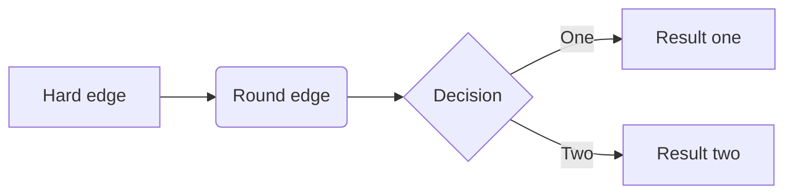

# My First Markdown Document

This is the first paragraph of my Markdown document. It contains some **bold text** and some _italic text_.

Here is a list of items:
- Item 1
- Item 2
- Item 3
- item 4

Here is a table:
| Column 1 | Column 2 | Column 3 |
| --- | --- | --- |
| Rowerere 1, Column 1 | Row 1, Column 2 | Row 1, Column 3 |
| Row 2, Column 1 | Row 2, Column 2 | Row 2, Column 3 |
| Row 3, Column 1 | Row 3, Column 2 | Row 3, Column 3 |




And here is a block of code:
```python
def square(x):
    return x ** 2
```

```mermaid
gitGraph
       branch dario
       commit
       commit
       branch develop
       checkout develop
       commit
       commit
       checkout main
       merge develop
       commit
       commit
       commit
       branch dario1
```
 

