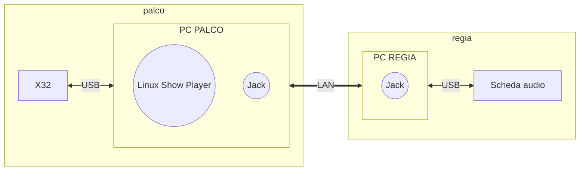

# Audio over IP

Script e software per la gestione audio in un tipico ambiente "live" con l'utilizzo di un mixer digitale (X32 rack o prodotti similari) collocato lato palco.

Il sistema è basato su 2 PC Linux (con distribuzione Ubuntu Studio o similari)
Vengono implementate le seguenti funzionlità:
- Invio di audio stereo dal mixer alla regia tipicamente ad uso "preascolto" (aka "PFL")
- Invio di audio stereo dalla regia al mixer tipicamente prodotto da hardware o software lì residente (ad esempio un software multimediale installato sul PC della regia od un microfono collegato alla scheda audio del suddetto)
- Gestione di basi ed effetti sonori 
Scopo principale è l'invio di audio stereo dal mixer alla regia tipicamente ad uso "preascolto" e dalla regia al mixer tipicamente prodotto da hardware o software (ad esempio un software multimediale o un microfono) presenti nella postazione regia.

Basi ed effetti sonori sono gestiti da Linux Show Player residente nel PC sul palco e invocato dal PC in regia

- Linux Show Player official release: https://github.com/FrancescoCeruti/linux-show-player
- Linux Show Player enhanced: https://github.com/dariomarini1967/linux-show-player/

I PC sono solitamente chiamati regia.local e palco.local (gli hostname vengono risolti usando il protocollo Avahi  il nome che si vuole assegnare al PC va configurato in `avahi-daemon.conf`)

